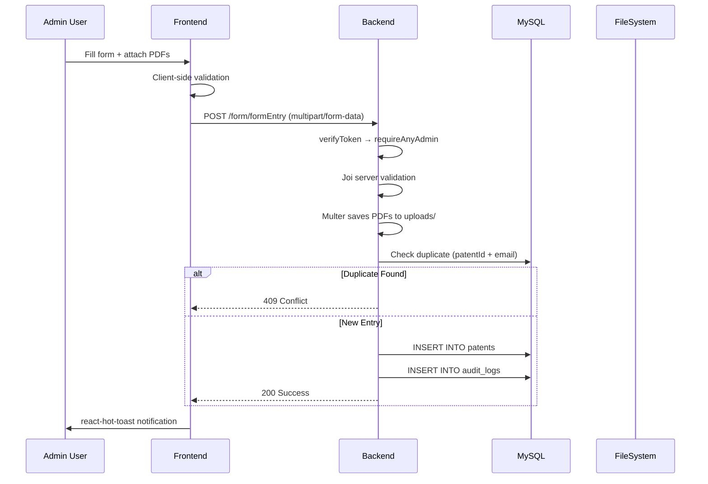
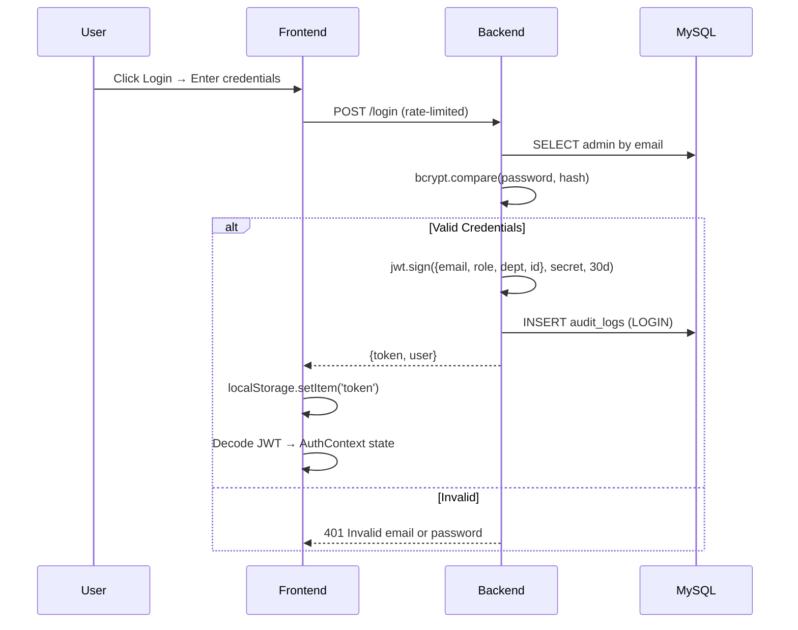

# 🏛️ College Publications & Patents Portal — Complete Codebase Analysis

> **NRI Institute of Technology** — Full-stack web portal for managing, browsing, and archiving faculty patents and publications.

---

## Tech Stack

| Layer | Technology | Version |
|-------|-----------|---------|
| **Frontend** | React + Vite | React 19, Vite 7 |
| **Styling** | TailwindCSS 4 | PostCSS integration |
| **Animations** | Framer Motion | v12 |
| **Icons** | Lucide React | v0.561 |
| **HTTP Client** | Axios | v1.13 |
| **Backend** | Node.js + Express | Express 5 (ES Modules) |
| **File Uploads** | Multer | v2 |
| **Excel** | ExcelJS + xlsx | Both libs used |
| **Validation** | Joi | v18 |
| **Database** | MySQL | via `mysql2/promise` |
| **Auth** | JWT + bcryptjs | 30-day tokens |
| **Security** | Helmet, CORS, rate-limit, compression | — |
| **Scheduled Jobs** | node-cron | Every 3 days @ 3AM |
| **Backup** | mysqldump + archiver (ZIP) | — |

---

## Project File Tree

```
College-Publications-Patents/
├── README.md
├── HOW_TO_RUN.md
├── PROJECT_ANALYSIS.md
├── package-lock.json        ← Root lock file
│
├── backend/                 ← Node/Express server
│   ├── index.js             ← Server entry point
│   ├── db.js                ← DB init, migrations, seeding
│   ├── login.js             ← POST /login
│   ├── package.json         ← Backend dependencies
│   ├── .env / .env.example
│   ├── error_log.txt        ← Runtime error logs
│   ├── routers/
│   │   ├── formHandling.js  ← Patent CRUD (~1079 lines)
│   │   └── Admin.js         ← Admin management routes
│   ├── middleware/
│   │   ├── verifyToken.js   ← JWT verification
│   │   └── authorization.js ← RBAC helpers
│   ├── services/
│   │   └── backupService.js ← mysqldump + ZIP + rotation
│   ├── utils/
│   │   └── logger.js        ← Audit log DB writer
│   ├── template/            ← Excel import template
│   ├── uploads/
│   │   ├── proof_of_publish/ ← Published PDFs
│   │   └── proof_of_grant/   ← Granted PDFs
│   └── backups/             ← ZIP backup archives
│
└── frontend/                ← React/Vite SPA
    ├── vite.config.js
    ├── tailwind.config.js
    ├── index.html
    ├── package.json
    ├── .env / .env.example
    └── src/
        ├── main.jsx         ← React DOM entry
        ├── App.jsx          ← Router + ProtectedRoute + Toaster
        ├── index.css        ← Global styles (Tailwind base)
        ├── api/
        │   └── axios.js     ← Configured axios instance
        ├── context/
        │   └── AuthContext.jsx  ← JWT state management
        ├── config/
        │   └── constants.js    ← DEPARTMENTS array, email validators
        ├── hooks/              ← Custom React hooks
        ├── pages/
        │   ├── Home.jsx        ← Public landing page
        │   ├── Upload.jsx      ← Patent submission (protected)
        │   └── NotFound.jsx    ← 404 page
        └── components/
            ├── common/
            │   ├── Header.jsx
            │   ├── Footer.jsx
            │   ├── SidePanel.jsx       ← Duplicate check slide-in
            │   ├── LoadingSkeleton.jsx
            │   ├── NumericPagination.jsx
            │   ├── CustomDatePicker.jsx
            │   ├── ErrorBoundary.jsx
            │   └── DeveloperModal.jsx
            ├── auth/
            │   └── LoginModal.jsx
            ├── data/
            │   ├── PublicationsTable.jsx  ← Main data table
            │   └── AdminPage.jsx          ← Full admin dashboard
            ├── forms/
            │   ├── UploadForm.jsx
            │   ├── BulkImport.jsx
            │   └── EditPublicationModal.jsx
            └── admin/
                ├── SystemActions.jsx    ← Backup & delete-all
                └── AuditLogsTable.jsx
```

---

## Architecture Overview

```mermaid
graph TD
    subgraph Frontend["Frontend (React/Vite :5173)"]
        A[Home - Public] --> B[PublicationsTable]
        C[Upload - Protected] --> D[UploadForm]
        C --> E[BulkImport Modal]
        C --> F[SidePanel - Duplicate Check]
        G[AdminPage - Protected] --> H[Admin Dashboard]
        I[LoginModal] --> J[AuthContext]
    end

    subgraph Backend["Backend (Express :3000)"]
        K["/login" - Auth Route]
        L["/form" - Patent CRUD]
        M["/admin" - Admin Ops"]
        N[Middleware: verifyToken + RBAC]
        O[BackupService + node-cron]
        P[logger.js - Audit Logs]
    end

    subgraph DB["MySQL Database"]
        Q[(patents)]
        R[(admins)]
        S[(audit_logs)]
    end

    J -- "JWT Bearer Token" --> K
    B -- "GET /form/formGet" --> L
    D -- "POST /form/formEntry" --> L
    E -- "POST /form/bulkImport" --> L
    H -- "Various /admin/*" --> M
    L --> N --> Q
    M --> N --> R
    K --> R
    L --> P --> S
    M --> P --> S
    O -- "mysqldump + ZIP" --> DB
```

---

## Database Schema

### `patents` — Core Data Table
| Column | Type | Notes |
|--------|------|-------|
| `id` | INT AUTO_INCREMENT | PK |
| `facultyName` | TEXT (FULLTEXT) | Faculty name |
| `email` | TEXT (indexed) | Faculty email |
| `department` | VARCHAR(255) (indexed) | CSE, ECE, EEE, MECH, CIVIL, IT, AIML, CSD, CSM, FED, MBA |
| `designation` | TEXT | Professor, Assoc. Prof., etc. |
| `caste` | VARCHAR(10) | Optional demographic |
| `patentId` | TEXT (indexed) | Patent application number |
| `patentTitle` | TEXT (FULLTEXT) | Title |
| `authors` | TEXT | Comma-separated |
| `coApplicants` | TEXT | Comma-separated |
| `patentType` | ENUM('Utility','Design') | Default: Utility |
| `approvalType` | TEXT | Published / Granted |
| `filingDate` | DATE | Required |
| `publishingDate` | DATE | Required |
| `grantingDate` | DATE | Optional |
| `documentLink` | TEXT | Path to proof-of-publish PDF |
| `grantDocumentLink` | TEXT | Path to proof-of-grant PDF |
| `created_at` / `updated_at` | DATETIME | Auto-managed |

### `admins` — Role-Based Admin Accounts
| Column | Type | Notes |
|--------|------|-------|
| `id` | INT AUTO_INCREMENT | PK |
| `email` | VARCHAR(255) UNIQUE | Login identifier |
| `password_hash` | TEXT | bcrypt hash |
| `role` | ENUM('super_admin','sub_admin') | Access level |
| `department` | VARCHAR(255) | Only for sub_admins |
| `created_by` | INT FK → admins(id) | Creator reference |

### `audit_logs` — Action Tracking
| Column | Type |
|--------|------|
| `id` | INT AUTO_INCREMENT |
| `user_email` | TEXT |
| `action` | TEXT (LOGIN, CREATE, UPDATE, DELETE, BULK_IMPORT, etc.) |
| `details` | TEXT |
| `timestamp` | DATETIME (indexed) |

> [!NOTE]
> [db.js](file:///c:/Users/neppa/Desktop/College-Publications-Patents/New%20folder/College-Publications-Patents/College-Publications-Patents/backend/db.js) auto-creates the database and all 3 tables on first run. It also runs **schema migrations** — if tables already exist, missing columns are added non-destructively. The default super admin account is seeded from env vars.

---

## Backend — Route Reference

### Auth: `POST /login`
- Rate-limited: 50 req / 10 min per IP
- bcrypt compare → JWT (30-day) containing `{userEmail, role, department, adminId}`
- Logs `LOGIN` to audit trail

---

### Patent Routes: `/form/*`

| Method | Endpoint | Auth | Description |
|--------|----------|------|-------------|
| `POST` | `/form/formEntry` | Any Admin | Create patent with PDF uploads |
| `POST` | `/form/bulkImport` | Any Admin | Bulk import from Excel array |
| `PUT` | `/form/formEntryUpdate` | Any Admin | Edit patent + optional new PDFs |
| `PUT` | `/form/formEntryBatchUpdate` | Super Admin | Batch update multiple patents (transaction) |
| `DELETE` | `/form/deleteEntry/:id` | Any Admin | Delete patent + cleanup physical files |
| `GET` | `/form/formGet` | **Public** | Paginated, filtered, sorted listing |
| `GET` | `/form/downloadExcel` | **Public** | Export filtered patents as styled `.xlsx` |
| `GET` | `/form/downloadTemplate` | **Public** | Blank Excel template with headers |

**Key implementation details:**
- **Joi validation** on all write endpoints (server-side)
- **Multer**: 5MB limit, PDF-only, saves to `uploads/proof_of_publish/` or `uploads/proof_of_grant/`
- **File naming**: `[PatentID]_[EmailUsername]_publish.pdf` / `_grant.pdf`
- **Duplicate check**: unique on `patentId + email` combination → returns 409
- **Date parsing**: handles Excel serial numbers, DD.MM.YYYY, DD/MM/YYYY, ISO 8601
- **Sub-admin scoping**: sub-admins can only CRUD within their department
- **File lifecycle**: old PDFs deleted on update/delete, `uploads/` wiped on delete-all

---

### Admin Routes: `/admin/*`

| Method | Endpoint | Auth | Description |
|--------|----------|------|-------------|
| `GET` | `/admin/me` | Any Admin | Current user profile |
| `GET` | `/admin/admins` | Super Admin | List all admins (paginated) |
| `POST` | `/admin/super-admin` | Super Admin | Create new super admin |
| `POST` | `/admin/sub-admin` | Super Admin | Create new sub admin + department |
| `PUT` | `/admin/:id/password` | Token | Change password (self or managed) |
| `PUT` | `/admin/my-password` | Any Admin | Change own password (requires current) |
| `DELETE` | `/admin/:id` | Super Admin | Delete admin (cannot self-delete) |
| `PUT` | `/admin/:id/department` | Super Admin | Reassign sub-admin's department |
| `GET` | `/admin/logs` | Any Admin | Paginated audit logs (dept-filtered for subs) |
| `GET` | `/admin/stats` | Any Admin | Dashboard stats (dept-scoped for subs) |
| `POST` | `/admin/deleteAll` | Super Admin | Wipe all patents + physical files |
| `POST` | `/admin/backup` | Super Admin | Trigger manual backup |
| `GET` | `/admin/departments` | Any Admin | List distinct departments |
| `POST` | `/admin/logs/cleanup` | Super Admin | Delete old audit log entries |

---

## Middleware Stack

### `verifyToken.js`
- Extracts `Bearer <token>` from `Authorization` header
- `jwt.verify()` → sets `req.user = { userEmail, role, department, adminId }`
- Handles `TokenExpiredError` specifically (401)

### `authorization.js` — RBAC Helpers
| Function | Behavior |
|----------|----------|
| `requireSuperAdmin` | Blocks non-super-admins with 403 |
| `requireAnyAdmin` | Blocks unauthenticated with 403 |
| `requireDepartmentAccess(field)` | Restricts sub-admins to req body field matching their dept |
| `isSuperAdmin()` / `isSubAdmin()` | Boolean helpers |

---

## Services & Utilities

### [backupService.js](file:///c:/Users/neppa/Desktop/College-Publications-Patents/New%20folder/College-Publications-Patents/College-Publications-Patents/backend/services/backupService.js) — Backup System
1. Run `mysqldump` → `database-TIMESTAMP.sql` in `backups/`
2. Password passed via `MYSQL_PWD` env var (avoids CLI exposure)
3. ZIP the SQL dump + `uploads/` folder into `backup-TIMESTAMP.zip`
4. Delete the temporary `.sql` file
5. **Auto-rotation**: delete `.zip` files older than 3 days
- Triggered by: `node-cron` (every 3 days @ 3AM) + `/admin/backup` API

### `logger.js` — Audit Logger
- Simple helper: `logAction(email, action, details)` → INSERT into `audit_logs`

---

## Frontend — Component Reference

### Routing ([App.jsx](file:///c:/Users/neppa/Desktop/College-Publications-Patents/New%20folder/College-Publications-Patents/College-Publications-Patents/frontend/src/App.jsx))
```
/ (Home)                  → Public
/upload                   → ProtectedRoute → Upload.jsx
/admin-dashboard          → ProtectedRoute → AdminPage.jsx
*                         → NotFound.jsx
```
- [ProtectedRoute](file:///c:/Users/neppa/Desktop/College-Publications-Patents/New%20folder/College-Publications-Patents/College-Publications-Patents/frontend/src/App.jsx#10-29) reads `isAuthenticated` from `AuthContext`
- Redirects unauthenticated users to `/`
- Shows spinner during auth `loading` state

### `AuthContext.jsx` — Auth State
- Decodes JWT **client-side** (no extra API call) on mount
- Validates expiration on init
- Provides: `user`, `isAuthenticated`, `loading`, `login()`, `logout()`, `isSuperAdmin()`, `isSubAdmin()`, `isAnyAdmin()`, `getUserDepartment()`

### `api/axios.js` — HTTP Client
- Base URL: `VITE_API_URL` → ngrok origin → `http://localhost:3000`
- **Request interceptor**: auto-attaches `Authorization: Bearer <token>` from `localStorage`
- **Response interceptor**: auto-calls `logout()` on 401 (except `/login`)

### `config/constants.js`
- `DEPARTMENTS` = `['CSE', 'ECE', 'EEE', 'MECH', 'CIVIL', 'IT', 'AIML', 'CSD', 'CSM', 'FED', 'MBA']`
- Email domain validation from `VITE_ALLOWED_EMAIL_DOMAINS` env var

---

## Page & Component Breakdown

### `Home.jsx` — Public Landing
- Hero banner with NRI Institute branding
- "Browse Repository" CTA → scrolls to data table
- `PublicationsTable` embedded with Refresh + Export toolbar

### `Upload.jsx` — Patent Submission (Protected)
- `UploadForm` for single patent entry
- Sidebar with: Bulk Import, Template Download, Export DB, Duplicate Check
- `SidePanel` slide-in shows live duplicate matches as user types
- Unsaved changes warning on page leave (beforeunload)

### `PublicationsTable.jsx`
- Server-side pagination, per-column filtering, column sorting
- PDF preview links open inline in browser
- Edit/Delete actions (scoped by role)
- Excel export respects active filters

### `AdminPage.jsx`
- Stats cards (total patents, admins, logs, departments)
- Admin management tab: CRUD for admins
- Audit logs tab: paginated, searchable
- System actions tab: backup trigger, delete-all

### `UploadForm.jsx`
- Full patent submission form
- Client-side validation + Joi-style checks
- Email domain validation (`VITE_ALLOWED_EMAIL_DOMAINS`)
- PDF file pickers for proof-of-publish and proof-of-grant
- Department field locked for sub-admins (read-only, auto-filled)

### `BulkImport.jsx`
- Accepts `.xlsx` file
- Reads rows client-side using `xlsx` library
- Shows validation preview table
- Posts parsed array to `POST /form/bulkImport`

### `LoginModal.jsx`
- Framer Motion animated modal
- Email + password form → `POST /login`
- On success: stores JWT in `localStorage`, updates `AuthContext`

---

## Data Flow Diagrams

### Patent Submission


### Authentication Flow


---

## Role-Based Access Control (RBAC)

| Feature | 🌐 Public | 🔵 Sub Admin | 🔴 Super Admin |
|---------|-----------|------------|--------------|
| Browse patents | ✅ | ✅ (own dept) | ✅ (all depts) |
| Export Excel | ✅ | ✅ | ✅ |
| Download template | ✅ | ✅ | ✅ |
| Submit patent | ❌ | ✅ (own dept) | ✅ (any dept) |
| Edit patent | ❌ | ✅ (own dept) | ✅ |
| Delete patent | ❌ | ✅ (own dept) | ✅ |
| Bulk import | ❌ | ✅ (own dept) | ✅ |
| Batch update | ❌ | ❌ | ✅ |
| View audit logs | ❌ | ✅ (dept-filtered) | ✅ (all) |
| Manage admins | ❌ | ❌ | ✅ |
| Trigger backup | ❌ | ❌ | ✅ |
| Delete all patents | ❌ | ❌ | ✅ |
| Dashboard stats | ❌ | ✅ (dept-scoped) | ✅ (global) |
| Cleanup old logs | ❌ | ❌ | ✅ |

---

## Environment Configuration

### Backend [.env](file:///c:/Users/neppa/Desktop/College-Publications-Patents/New%20folder/College-Publications-Patents/College-Publications-Patents/backend/.env)
| Variable | Purpose | Required |
|----------|---------|----------|
| `PORT` | Server port (default: 3000) | No |
| `FRONTEND_URL` | CORS allowed origin | No |
| `DB_HOST` | MySQL host | **Yes** |
| `DB_USER` | MySQL user | **Yes** |
| `DB_PASSWORD` | MySQL password | No |
| `DB_NAME` | Database name | **Yes** |
| `JWT_SECRET` | Token signing key | **Yes** |
| `BCRYPT_ROUNDS` | Hash cost (default: 10) | No |
| `SUPER_ADMIN_EMAIL` | Seed admin email | No |
| `SUPER_ADMIN_PASSWORD` | Seed admin password | No |

### Frontend [.env](file:///c:/Users/neppa/Desktop/College-Publications-Patents/New%20folder/College-Publications-Patents/College-Publications-Patents/backend/.env)
| Variable | Purpose |
|----------|---------|
| `VITE_API_URL` | Backend URL override (auto-detects otherwise) |
| `VITE_ALLOWED_EMAIL_DOMAINS` | Comma-separated email domains for validation |

---

## File Upload & Storage

```
backend/
├── uploads/
│   ├── proof_of_publish/
│   │   └── {PatentID}_{emailUser}_publish.pdf
│   └── proof_of_grant/
│       └── {PatentID}_{emailUser}_grant.pdf
└── backups/
    └── backup-YYYY-MM-DDTHH-MM-SS.zip  (SQL + uploads)
```

- Files served via `GET /uploads/*` with `Content-Disposition: inline`
- PDFs can be previewed directly in the browser
- Auto-cleanup on record delete / bulk delete

---

## Key Design Patterns

1. **Self-initializing database** — [db.js](file:///c:/Users/neppa/Desktop/College-Publications-Patents/New%20folder/College-Publications-Patents/College-Publications-Patents/backend/db.js) creates DB, tables, indexes, and seeds super admin on first run; no manual setup needed
2. **Schema migrations** — Missing columns/indexes added non-destructively at startup
3. **Soft auth on public endpoints** — `GET /form/formGet` optionally reads JWT to scope sub-admin views, but works without auth for public browsing
4. **File lifecycle management** — PDFs cleaned up on update (replace), delete (remove), and bulk delete (wipe directories)
5. **Client-side JWT decoding** — `AuthContext` decodes the token locally to avoid an extra API call on page load
6. **Filter-aware exports** — Excel export passes the same query params as the table filter, so exports always match the current view
7. **Secure backup passwords** — `mysqldump` password is passed via `MYSQL_PWD` env var rather than a CLI flag, preventing exposure in process lists
8. **ES Modules throughout** — Both backend (`"type": "module"`) and frontend use native ES module syntax

---

## How to Run

### Prerequisites
- Node.js 18+
- MySQL server running
- `mysqldump` in PATH (for backups)

### Backend
```bash
cd backend
npm install
# Copy .env.example to .env and fill in values
npm run dev        # Development (nodemon)
npm start          # Production
```

### Frontend
```bash
cd frontend
npm install
# Copy .env.example to .env (optional)
npm run dev        # Dev server at :5173
npm run build      # Build for production → dist/
```

### Production (combined)
The backend serves `frontend/dist` as static files. Build the frontend, then run only the backend:
```bash
cd frontend && npm run build
cd ../backend && npm start
# Access at http://localhost:3000
```

> [!IMPORTANT]
> The backend requires `JWT_SECRET`, `DB_HOST`, `DB_USER`, and `DB_NAME` to be set in `.env` or it will exit immediately.

---

## Security Highlights

| Concern | Implementation |
|---------|---------------|
| SQL Injection | Parameterized queries via `mysql2` |
| Password Storage | bcryptjs (configurable rounds) |
| Token Auth | JWT with 30-day expiry, verified on every protected request |
| Rate Limiting | 50 req/10 min on `/login` |
| File Upload Safety | PDF-only filter, 5MB limit, organized directories |
| CORS | Whitelist: localhost, LAN IPs, ngrok, `FRONTEND_URL` |
| HTTP Headers | Helmet CSP configured |
| Error Info Leakage | Stack traces logged to file, never sent to client |
| Password in CLI | `MYSQL_PWD` env var for mysqldump |
